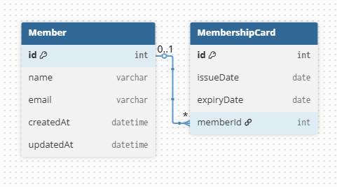
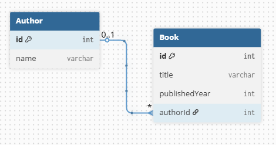
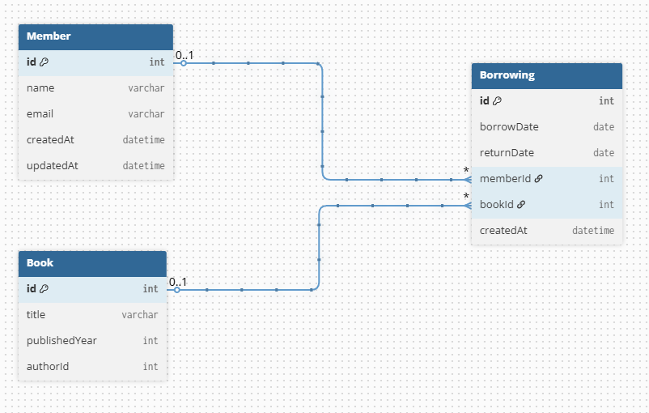

# 📚 Library Management System API

A robust **Library Management System** built with **NestJS**, **PostgreSQL**, and **TypeORM**.

---

## 🚀 Overview

This backend API demonstrates a complete Library Management System with proper database relationships and clean architecture.

**Tech Stack:**

- **NestJS** — Framework
- **PostgreSQL** — Database
- **TypeORM** — ORM
- **Swagger** — API Documentation
- **Class Validator** — Input Validation

---

## 🧩 Features

- 👤 Member Management with **automatic** Membership Card generation
- 🆔 One-to-One Relationship: Member ↔ MembershipCard
- 🆔 Membership Card retrieval
- ✍️ Author Management
- 📘 Book Management with Author association
- 🔄 Borrowing System (Many-to-Many relationship between Member and Book)
- Consistent API response format

---

## 🗄️ Database Relationships

```
Member ──── MembershipCard   (1:1)
Author ──── Book             (1:N)
Member ──── Borrowing ──── Book   (M:N)
```

---

## 🗂️ ERD Diagrams

> Visual representation of the database schema and entity relationships.

### Full ERD


### Member & Membership Card (1:1)



### Author & Book (1:N)



### Borrowing System (M:N)



---

## 🔗 API Endpoints

### 👤 Members

| Method | Endpoint | Description |
|--------|----------|-------------|
| `POST` | `/api/v1/members` | Create a new member (auto-generates Membership Card) |
| `GET` | `/api/v1/members` | Get all members |
| `GET` | `/api/v1/members/:id` | Get member by ID |

### 🆔 Membership Cards

| Method | Endpoint | Description |
|--------|----------|-------------|
| `GET` | `/api/v1/membership-cards/member/:memberId` | Get membership card by member ID |


### ✍️ Authors

| Method | Endpoint | Description |
|--------|----------|-------------|
| `POST` | `/api/v1/authors` | Create a new author |
| `GET` | `/api/v1/authors` | Get all authors |

### 📘 Books

| Method | Endpoint | Description |
|--------|----------|-------------|
| `POST` | `/api/v1/books` | Create a new book with author |
| `GET` | `/api/v1/books` | Get all books |
| `GET` | `/api/v1/books/:id` | Get book by ID |

### 🔄 Borrowings

| Method | Endpoint | Description |
|--------|----------|-------------|
| `POST` | `/api/v1/borrowings` | Borrow a book |

---

## 📡 Response Format

All endpoints follow this consistent structure:

```json
{
  "success": true,
  "message": "Operation successful",
  "data": { }
}
```

---

## 📚 Swagger Documentation

Interactive API documentation is available at:

🔗 **Swagger UI:** `http://localhost:3000/api`

---

## ⚙️ Installation & Setup

```bash
# 1. Clone the project
git clone https://github.com/SheikhSarim/library-management.git
cd library-management-system

# 2. Install dependencies
npm install

# 3. Configure PostgreSQL database
# Update host, username, password, and database name in app.module.ts

# 4. Run the application
npm run start:dev
```

---

## 🧪 Testing

You can test the APIs using:

- **Swagger UI** — `http://localhost:3000/api/docs`
- **Postman**
- **`.http` files** — included in each module

---

## 🛠️ Key Business Logic

- Membership Card is automatically generated when a member is created
- Proper validation of member and book existence before borrowing
- Clean separation of concerns (Controllers, Services, Entities, DTOs)
- Consistent and readable API responses

---

## 🚀 Future Improvements

- JWT Authentication & Authorization
- Book availability tracking
- Return book functionality with due dates and fines
- Pagination and search support
- Admin dashboard
- Redis caching

---

## 🧑‍💻 Developer

**Sarim** — Backend System Design Assignment  
Built with **NestJS** + **PostgreSQL** + **TypeORM**

---

## 📄 License

This project is developed for educational purposes only.