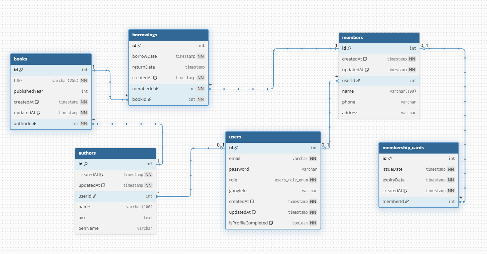
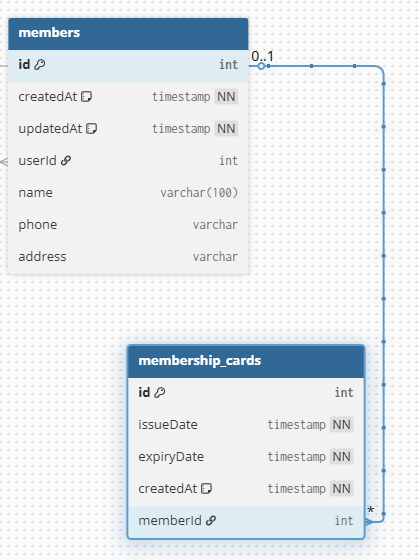
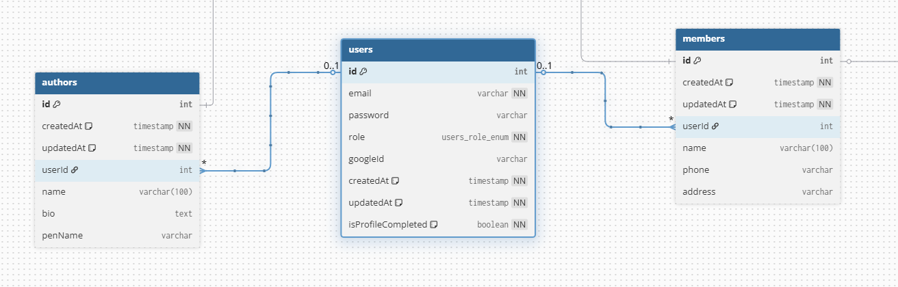

# 📚 Library Management System API

A production-ready **Library Management System** built with **NestJS**, **PostgreSQL**, **TypeORM**, and **Google OAuth 2.0**.

---

## 🚀 Overview

A full-featured Library Management System backend with JWT authentication, role-based access control, Google OAuth 2.0, and clean modular architecture.

### Tech Stack

* **NestJS** — Framework
* **PostgreSQL** — Database
* **TypeORM** — ORM
* **JWT** — Authentication (Access + Refresh Tokens)
* **Google OAuth 2.0** — Social Authentication
* **Bcrypt** — Password Hashing
* **Swagger** — API Documentation
* **Class Validator** — Input Validation
* **Cookie Parser** — HTTP-Only Cookie Management

---

## 🧩 Features

* 🔐 JWT Authentication with Access & Refresh Tokens
* 🔑 Google OAuth 2.0 Authentication
* 👥 Role-Based Access Control (RBAC)
* 👤 Member Management System
* ✍️ Author Management System
* 📘 Book Management
* 🔄 Borrowing System
* 🆔 Auto-generated Membership Cards
* 📄 Consistent API Response Structure

---

## 🗄️ Database Relationships

```txt
User    ──── Member          (1:1)
User    ──── Author          (1:1)
Member  ──── MembershipCard  (1:1)
Author  ──── Book            (1:N)
Member  ──── Borrowing ──── Book   (M:N)
```

---

## 🗂️ ERD Diagrams

> Visual representation of the database schema and entity relationships.

### Full ERD



### Member & Membership Card (1:1)




### Author & Book (1:N)


### Borrowing System (M:N)


---

## 🏗️ Architecture

```txt
            User (Auth Layer)
--------------------------------------------            
role = MEMBER        |    role = AUTHOR
      ↓              |        ↓ 
Member Profile       |  Author Profile
      ↓              |        ↓
MembershipCard       |    Book Creation
      ↓
Borrowing System
```

### Separation of Concerns

* `User` table → authentication only
* `Member` / `Author` tables → role-specific profile data
* `Auth Module` → login, register, JWT, Google OAuth
* `Users Module` → DB operations only

---

## 🔐 Authentication Flow

### Manual Register/Login

```txt
Member/Author Register
        ↓
Hash password → Create User → Create Profile → JWT Cookies
```

### Google OAuth 2.0

```txt
Frontend → Google Popup → ID Token + Role
        ↓
Backend verifyIdToken() → Create/Find User by Role → JWT Cookies
```


### JWT Storage

Tokens are stored in **HTTP-Only cookies**:

* `accessToken` — 1 hour TTL
* `refreshToken` — 1 day TTL

---

## 📡 Response Format

```json
{
  "success": true,
  "message": "Operation successful",
  "data": {}
}
```

---

## ⚙️ Installation & Setup

```bash
# 1. Clone the project
git clone https://github.com/SheikhSarim/library-management.git

# 2. Move into project
cd library-management

# 3. Install dependencies
npm install

# 4. Configure environment
cp .env.example .env.development

# 5. Run development server
npm run start:dev
```

---

## 🔧 Environment Variables

```env
# App
PORT=3000
ENV=development

# Database
DATABASE_HOST=localhost
DATABASE_PORT=5432
DATABASE_NAME=library-ms-db
DATABASE_USER=postgres
DATABASE_PASSWORD=your_password
DATABASE_AUTOLOAD_ENTITIES=true
DATABASE_SYNC=true

# JWT
JWT_SECRET=your_secret_key_minimum_32_chars
JWT_ACCESS_TTL=3600
JWT_REFRESH_TTL=86400

# Google OAuth 2.0
GOOGLE_CLIENT_ID=your_client_id.apps.googleusercontent.com
```

---

## 📚 Swagger Documentation

```txt
http://localhost:3000/api
```

---

## 🧪 Testing

* Swagger UI
* Postman
* `.http` files included in each module

---

## 🛠️ Key Business Logic

* Member registration automatically creates Membership Card
* Author registration automatically creates Author profile
* Borrowing requires valid Membership Card
* Book creation restricted to AUTHOR role
* JWT guard applied globally
* Roles guard enforces RBAC

---

## 🚀 Future Improvements

* Return book functionality
* Due dates & fines
* Book availability tracking
* Search
* Redis caching
* Admin dashboard

---

## 🧑‍💻 Developer

**Sarim** — Backend System Design

Built with **NestJS** + **PostgreSQL** + **TypeORM** + **Google OAuth 2.0**
